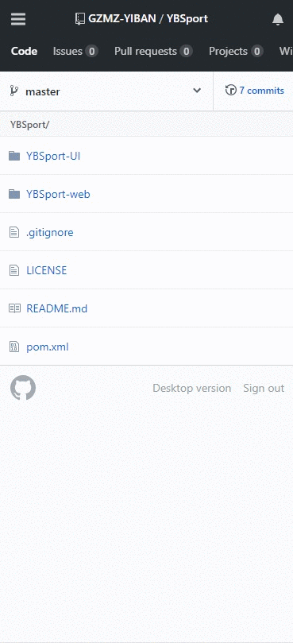

# YBSport

易运动，通过易班app所记录的每日步数可兑换相应的网薪。

# 简介

易运动是我非常想做的一个项目，从五月底开始就一直很想做，当时一时兴起做好了前端，
不得不说我前端功底不怎么样，但是却意外的达到了我期望的效果，让我十分喜欢。
所以从几个月前就想做的。当时的技术选型就是 mui + vert.x，
但是不得不说我的实力有限，还不能很好的理解其异步思想，虽然说现在也是有点模糊，但是勉强写的出来了。
放假实习完毕后，回来家的第一件事就是完成自己想做的这个应用，以前了解过vert.x也自己看过相关的资料，
但不得不说思想的转变是极其困难的，需要时间和努力去不断熏陶。直到今天都只是入门，然后磕磕碰碰的写出了第一个模块
**YBSport-web** ，其对应的前端 **YBSport-UI**。但是中间也出现很多很多问题。

# 技术选型
- 核心框架: vert.x web、vert.x web client
- 配置管理: vert.x conf
- 单元测试: junit4、vert.x unit
- 反向代理: nginx
- 数据库: postgreSQL 10
- 日志：log4j2
- 前端：mui

# 使用

本应用为我校 易班工作站 开发，需要提供易班工作站的接口和用户信息方能使用。

环境：nginx + idea + postgresql 10

## nginx 配置

nginx 用于反向代理静态页面，[官网下载地址](http://nginx.org/en/download.html)

windows 可以直接 [下载](http://nginx.org/download/nginx-1.15.2.zip)

Centos7 可以借鉴此教程 [Centos7安装Nginx实战 - 阿豪聊干货 - 博客园](http://note.youdao.com/noteshare?id=c0e4bb495ad5ade62a546f4efc7773c2&sub=wcp1535266273108984)

其他 linux 发行版需要自行寻找教程。

nginx 需要配置端口号和起始路径,请查看 conf/nginx.conf
```text
我的如下配置：

    server {
        listen       8001;
        server_name  localhost;

        location / {
           root   E:\work\yiban\YBWorkSpace\YBSport\YBSport-UI;
           index  index.html index.htm;
        }
    }
    
其中 8001 为你 nginx 反向代理页面的端口号
```


## idea 配置

clone 下此项目后默认没有配置模块，请自行在 project structure 进行配置。

依赖管理使用 maven，请在 idea 中自行引入 import 依赖

请修改 YBSport-web / src / main / resources / conf / config-bak.json 配置文件，并重命名为 config.json

然后，修改 UI 模块的 index.html 中 ajax 请求的地址端口为 你配置 config.json 中 http 下的 port 端口号，默认 8888 

如果你需要修改日志输出位置（默认当前系统用户家目录/logs/YbSport/），请修改 log4j2.xml 即可

```xml

<Properties>
    <property name="log_charset">UTF-8</property>
    <property name="log_pattern">
        %d{yyyy-MM-dd HH:mm:ss} [%5p] [%t] (%F:%L) %m%n
    </property>
    <!--修改此处-->
    <property name="logBaseFolder">${sys:user.home}/logs/YbSport/</property>
    <property name="every_file_size">100MB</property>
</Properties>
```

## 数据库配置

数据库我用惯了 mysql，想尝试下新的，所以选择了 postgresql。


三张表：ybsport_buy、ybsport_time、ybsport_type

- ybsport_buy 易运动兑换记录：用来记录哪些兑换了
- ybsport_time 易运动活动开始时间：用来记录什么时候开始什么时候结束，可以选择为长期活动
- ybsport_type 易运动兑换的类型：记录了可以兑换哪些类型。

数据库结构文件存放于 doc/sql 下，可能需要你手动绑定下 **ybsport_buy.type** 和 **ybsport_type.id** 的外键信息

> 注意:在 sql 文件中,我将他的所有者给了 yiban 这个用户，可能你需要手动修改下，例如修改 alter table ybsport_type owner to yiban 为你希望的用户

> 注意:ybsport_time 里面每次数据库都只查询第一条启用的数据，如果此数据的 **备注** 字段为 **长期** ，那么易运动
这个活动就是长期新的，否则就是指定时间内的，如果没有启用的数据，那么默认活动未开启。

> 注意:ybsport_buy 中的 yb_user 字段为 json 格式 

## 基于易班使用

请登录 [易班开放平台](https://open.yiban.cn/) ，然后完成以下操作
1. 注册账户 -> 申请成为开发者
2. 上方导航 管理中心 -> 左侧 轻应用 -> 创建轻应用 
3. 填写资料时，维护地址可不填，应用地址为 http://localhost:8001，8001 即为你配置的 nginx 的端口号。
4. 进入 管理中心 -> 轻应用 -> 你创建的应用 -> 点击名字 进入到应用详情，获取到 **AppID** , **AppSecret** 和 **站内地址**
5. 将获取到的 **AppID** , **AppSecret** , **站内地址** 填入 **cn.echocow.yiban.ybsport.utils.ConstEnum** 中
6. 修改 易班防跨站伪造参数 为你指定的值
7. 运行 nginx 、postgresql 、idea 中运行 cn.echocow.yiban.ybsport.Application

> 注意：如果要在电脑端查看，请 修改应用 -> 使用场景 -> 兼容易班客户端、PC/手机浏览器

## 脱离易班使用

脱离易班使用极其复杂，首先你需要自定义 **ConvertRestVerticle** 多个获取步数的方法，并要符合前端接受的 json 格式

1. 修改方法  getSteps 
2. 删除方法  checkAuth 
3. 删除方法  sendMessage 
4. 删除所有的验证，参数改为在 rest 接口方法内获取
5. 自行解析以及存储和验证 ybsport_buy

在 **ConvertDbVerticle** 你也要自行修改相应的验证。

运行 nginx 、postgresql 、idea 中运行 cn.echocow.yiban.ybsport.Application

# Documentation
请查看 [wiki](https://github.com/GZMZ-YIBAN/YBSport/wiki) 以了解更多信息

# 应用截图
我在 UI 模块提供 `static.html` 可以直接看到成功的前端效果演示。当然现在也已经上线 易班应用广场 可以直接 [查看](http://yiban.echocow.cn/YBSport/)


